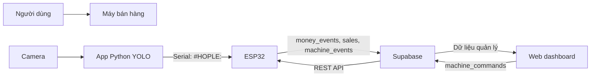

## Đề tài

**Hệ thống máy bán hàng tự động sử dụng ESP32, nhận diện tiền bằng YOLO và quản lý từ xa qua Web**

## Thành viên nhóm

| Họ và tên | Mã sinh viên |
| --- | --- |
| Nguyễn Văn Quân | 22021511 |
| Nguyễn Bình Minh | 22021504 |
| Nguyễn Việt Tiến | 22021500 |

## Link triển khai

Web dashboard:

```text
https://vending-machine-cloud.vercel.app
```

Source code GitHub:

```text
https://github.com/QTS1806/vending-machine-cloud
```

## Mục đích của repository

Repository này lưu các phần source code chính của hệ thống máy bán hàng tự động trong đồ án, bao gồm:

- Firmware ESP32 điều khiển máy bán hàng.
- Giao diện Web quản lý máy bán hàng.
- Cấu trúc cơ sở dữ liệu Supabase.
- Tài liệu tích hợp app Python YOLO nhận diện tiền.

Không đưa toàn bộ source code vào báo cáo Word. Báo cáo chỉ trích các đoạn code quan trọng và dẫn link GitHub này tại phần phụ lục.

## Cấu trúc thư mục

```text
vending-machine-cloud
├─ firmware/
│  └─ may_ban_hang_cloud/
│     ├─ may_ban_hang_cloud.ino
│     └─ secrets.example.h
├─ supabase/
│  ├─ schema.sql
│  ├─ add_total_refunded.sql
│  └─ fix_touch_trigger.sql
├─ web/
│  ├─ src/
│  │  ├─ App.jsx
│  │  ├─ main.jsx
│  │  └─ styles.css
│  ├─ package.json
│  └─ vite.config.js
├─ python/
│  └─ README.md
├─ README.md
└─ vercel.json
```

## Các file quan trọng

| File/Thư mục | Vai trò |
| --- | --- |
| `firmware/may_ban_hang_cloud/may_ban_hang_cloud.ino` | Firmware ESP32 điều khiển máy bán hàng, đọc cảm biến/nút bấm, điều khiển relay/motor và đồng bộ Supabase |
| `firmware/may_ban_hang_cloud/secrets.example.h` | File mẫu cấu hình WiFi và Supabase cho ESP32 |
| `supabase/schema.sql` | Tạo bảng dữ liệu, policy, index và dữ liệu mẫu cho Supabase |
| `web/src/App.jsx` | Logic chính của Web dashboard |
| `web/src/styles.css` | Giao diện và bố cục Web dashboard |
| `web/package.json` | Danh sách thư viện và script chạy Web |
| `python/README.md` | Ghi chú cách app Python YOLO giao tiếp với ESP32 |

## Các đoạn code quan trọng

Phần này trích một số đoạn code đại diện cho các chức năng cốt lõi của hệ thống. Các đoạn code đầy đủ nằm trong từng file tương ứng của repository.

### 1. ESP32 nhận kết quả tiền hợp lệ từ app Python

File:

```text
firmware/may_ban_hang_cloud/may_ban_hang_cloud.ino
```

Khi app Python nhận diện được tiền, app gửi chuỗi `#HOPLE:<amount>` qua Serial. ESP32 đọc chuỗi này và lưu số tiền tạm thời vào biến `tienMoiNhan`.

```cpp
if (data.startsWith("#HOPLE:"))
{
  tienMoiNhan = data.substring(7).toInt();

  Serial.print("Nhan tien: ");
  Serial.println(tienMoiNhan);
  return;
}
```

### 2. ESP32 gửi tín hiệu bắt đầu/kết thúc nhận tiền cho Python

Khi cảm biến đầu phát hiện tiền đi vào, ESP32 gửi `#START` để app Python bắt đầu nhận diện. Khi tiền đi tới cảm biến cuối, ESP32 gửi `#END` để báo quá trình nhận tiền đã kết thúc.

```cpp
tienMoiNhan = 0;
Serial.println("#START");
chayBangTaiTienVao();
doiTrangThaiTien(TIEN_DANG_DI, now);
```

```cpp
if (tienDenCuoi)
{
  Serial.println("#END");

  if (tienMoiNhan > 0)
  {
    doiTrangThaiTien(TIEN_DI_THEM, now);
  }
  else
  {
    chayBangTaiTienRa();
    doiTrangThaiTien(TIEN_DANG_LUI, now);
  }
}
```

### 3. ESP32 cộng tiền hợp lệ và đưa dữ liệu vào hàng chờ gửi Cloud

Sau khi tiền đi qua cảm biến cuối và đã được Python xác nhận hợp lệ, ESP32 cộng tiền vào số dư hiện tại, sau đó gọi `cloudMoneyAccepted()` để đưa sự kiện tiền vào hàng chờ gửi lên Supabase.

```cpp
dungBangTaiTien();
tienDangCo += tienMoiNhan;
cloudMoneyAccepted(tienMoiNhan);
tienMoiNhan = 0;
doiTrangThaiTien(TIEN_CHO, now);
showHome();
```

### 4. ESP32 xử lý bán hàng, trừ tiền và giảm tồn kho

Khi bán hàng thành công hoặc khi động cơ quay quá lâu theo yêu cầu hiện tại, ESP32 trừ tiền sản phẩm, giảm tồn kho và đưa dữ liệu bán hàng vào hàng chờ gửi lên Supabase.

```cpp
void ghiNhanBanHangDaTruTien(int sp, const String &saleMessage)
{
  long giaDaBan = giaSP[sp];
  long tienTruocKhiBan = tienDangCo;

  tienDangCo -= giaDaBan;
  if (tienDangCo < 0)
  {
    tienDangCo = 0;
  }

  if (soLuongSP[sp] > 0)
  {
    soLuongSP[sp]--;
  }

  cloudSaleSuccess(sp, giaDaBan, tienTruocKhiBan, tienDangCo, saleMessage);
}
```

### 5. ESP32 đọc lệnh cấu hình từ Web

ESP32 định kỳ đọc bảng `machine_commands` để lấy các lệnh còn trạng thái `pending` theo đúng `MACHINE_ID`. Sau khi áp dụng lệnh, ESP32 đánh dấu lệnh là `done` hoặc `failed`.

```cpp
String path = String("machine_commands?select=id,command_type,payload")
              + "&machine_id=eq." + MACHINE_ID
              + "&status=eq.pending"
              + "&order=created_at.asc"
              + "&limit=1";

if (!cloudRequest("GET", path, "", &response))
{
  return;
}
```

```cpp
bool ok = cloudApplyCommand(String(type), payload);
cloudMarkCommand(id, ok, ok ? "" : "apply failed");
```

### 6. Web kết nối Supabase

File:

```text
web/src/App.jsx
```

Web sử dụng thư viện `@supabase/supabase-js`. URL và key được lấy từ biến môi trường Vercel hoặc file `.env` khi chạy local.

```jsx
const supabaseUrl = import.meta.env.VITE_SUPABASE_URL;
const supabaseAnonKey = import.meta.env.VITE_SUPABASE_ANON_KEY;

const supabase = isConfigured ? createClient(supabaseUrl, supabaseAnonKey) : null;
```

### 7. Web tạo lệnh gửi xuống ESP32

Khi người quản trị sửa giá hoặc số lượng sản phẩm trên Web, Web tạo một bản ghi mới trong bảng `machine_commands`. ESP32 sẽ đọc và áp dụng lệnh này trong Cloud Task.

```jsx
const createCommand = async (commandType, payload) => {
  const { error: commandError } = await supabase.from("machine_commands").insert({
    machine_id: machineId,
    command_type: commandType,
    payload,
  });

  if (commandError) {
    throw commandError;
  }
};
```

Ví dụ gửi lệnh cập nhật một sản phẩm:

```jsx
await createCommand("set_product", {
  slot: Number(product.slot),
  name: displayProductName(product),
  price: Number(product.price),
  stock: Number(product.stock),
  enabled: Boolean(product.enabled),
});
```

### 8. Web lắng nghe thay đổi dữ liệu từ Supabase

Web sử dụng realtime channel để cập nhật lại giao diện khi có dữ liệu bán hàng, tiền, cảnh báo hoặc lệnh cấu hình mới.

```jsx
const channel = supabase
  .channel("vending-dashboard")
  .on(
    "postgres_changes",
    { event: "INSERT", schema: "public", table: "sales" },
    loadData,
  )
  .on(
    "postgres_changes",
    { event: "INSERT", schema: "public", table: "money_events" },
    loadData,
  )
  .on(
    "postgres_changes",
    { event: "*", schema: "public", table: "machine_commands" },
    loadData,
  )
  .subscribe();
```

### 9. Cấu trúc bảng chính trong Supabase

File:

```text
supabase/schema.sql
```

Ví dụ bảng `machines` lưu trạng thái và thống kê của từng máy:

```sql
create table if not exists public.machines (
  id text primary key,
  name text not null,
  location text,
  status text not null default 'offline',
  firmware_version text,
  current_credit integer not null default 0,
  cash_in_box integer not null default 0,
  total_sales integer not null default 0,
  total_revenue integer not null default 0,
  total_refunded integer not null default 0,
  last_seen_at timestamptz
);
```

Bảng `machine_commands` dùng để Web gửi lệnh cấu hình xuống ESP32:

```sql
create table if not exists public.machine_commands (
  id bigint generated by default as identity primary key,
  machine_id text not null references public.machines(id) on delete cascade,
  command_type text not null,
  payload jsonb not null default '{}'::jsonb,
  status text not null default 'pending',
  error_message text,
  created_at timestamptz not null default now(),
  processed_at timestamptz
);
```

## Luồng hoạt động chính



Mô tả ngắn:

1. Người dùng đưa tiền vào máy.
2. ESP32 gửi `#START` cho app Python.
3. Python nhận diện tiền bằng YOLO và gửi `#HOPLE:<amount>` về ESP32 nếu hợp lệ.
4. ESP32 xử lý số dư, bán hàng, hoàn tiền và điều khiển động cơ.
5. ESP32 ghi dữ liệu lên Supabase.
6. Web dashboard đọc dữ liệu Supabase và hiển thị doanh thu, tồn kho, lịch sử bán hàng, tiền và cảnh báo.
7. Khi người quản trị sửa cấu hình trên Web, Web tạo lệnh trong `machine_commands`; ESP32 đọc lệnh và cập nhật cấu hình local.

## Cơ sở dữ liệu Supabase

Các bảng chính:

| Bảng | Chức năng |
| --- | --- |
| `machines` | Thông tin máy, trạng thái online/offline, số dư, doanh thu, tiền đã nhận/trả lại |
| `products` | Danh sách sản phẩm theo từng máy và từng slot |
| `sales` | Lịch sử bán hàng |
| `money_events` | Lịch sử tiền vào/tiền ra |
| `machine_events` | Nhật ký máy và cảnh báo |
| `machine_commands` | Lệnh cấu hình từ Web gửi xuống ESP32 |

Chạy schema ban đầu trong Supabase SQL Editor:

```text
supabase/schema.sql
```

## Chạy Web ở máy local

Yêu cầu:

- Node.js
- npm
- Supabase project

Tạo file:

```text
web/.env
```

Theo mẫu:

```env
VITE_SUPABASE_URL=https://YOUR_PROJECT_REF.supabase.co
VITE_SUPABASE_ANON_KEY=YOUR_SUPABASE_ANON_OR_PUBLISHABLE_KEY
```

Chạy Web:

```bash
cd web
npm install
npm run dev
```

Mở:

```text
http://127.0.0.1:5173
```

## Deploy Web lên Vercel

Web được deploy bằng Vercel. Khi deploy cần cấu hình Environment Variables:

```env
VITE_SUPABASE_URL=https://YOUR_PROJECT_REF.supabase.co
VITE_SUPABASE_ANON_KEY=YOUR_SUPABASE_ANON_OR_PUBLISHABLE_KEY
```

Build kiểm tra:

```bash
cd web
npm run build
```

## Nạp firmware ESP32

Mở file:

```text
firmware/may_ban_hang_cloud/may_ban_hang_cloud.ino
```

Tạo file cấu hình riêng:

```text
firmware/may_ban_hang_cloud/secrets.h
```

Dựa trên mẫu:

```text
firmware/may_ban_hang_cloud/secrets.example.h
```

Ví dụ cấu trúc:

```cpp
const char *WIFI_SSID = "YOUR_WIFI_SSID";
const char *WIFI_PASSWORD = "YOUR_WIFI_PASSWORD";
const char *SUPABASE_URL = "https://YOUR_PROJECT_REF.supabase.co";
const char *SUPABASE_ANON_KEY = "YOUR_SUPABASE_ANON_OR_PUBLISHABLE_KEY";
const char *MACHINE_ID = "vending-001";
```

Thư viện Arduino cần cài:

- ESP32 board package
- ArduinoJson
- LiquidCrystal_I2C

Serial Monitor:

```text
115200 baud
```

## Mở rộng thêm máy bán hàng

Mỗi máy cần một `MACHINE_ID` riêng:

```cpp
const char *MACHINE_ID = "vending-002";
```

Web và database tách dữ liệu theo `machine_id`, vì vậy có thể mở rộng thêm nhiều máy như:

```text
vending-001
vending-002
vending-003
```

## Ghi chú bảo mật

Repository public không chứa:

- `web/.env`
- `firmware/may_ban_hang_cloud/secrets.h`
- WiFi password thật
- Supabase key thật

Các file cấu hình thật chỉ nên lưu ở máy cá nhân hoặc trong Environment Variables của Vercel.

## Phạm vi đồ án

Repository phục vụ mục đích học tập và báo cáo đồ án. Hệ thống hiện ở mức mô hình thử nghiệm, tập trung kiểm chứng:

- Điều khiển máy bán hàng bằng ESP32.
- Nhận diện tiền bằng YOLO qua app Python.
- Ghi nhận dữ liệu lên Supabase.
- Quản lý máy bán hàng qua Web dashboard.
- Deploy Web bằng Vercel.

Nếu triển khai thực tế, cần bổ sung đăng nhập, phân quyền, bảo mật API và cơ chế xác thực thiết bị.

