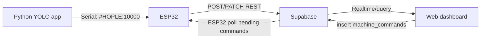

# Tai lieu chuyen giao he thong may ban hang tu dong

Tai lieu nay dung de chuyen giao du an cho mot tai khoan hoac mot nguoi khac tiep tuc phat trien. Nguoi nhan nen doc file nay truoc, sau do mo repo GitHub va cac file code theo duong dan ben duoi.

## 1. Tong quan he thong

He thong gom 4 phan chinh:

1. ESP32 dieu khien may ban hang vat ly: nut bam, cam bien, relay motor, LCD, nhan tien tu app Python qua Serial, dong bo du lieu voi Supabase.
2. App Python nhan dien tien bang YOLO: mo camera, nhan dien menh gia tien, gui `#HOPLE:<so_tien>` ve ESP32 qua COM.
3. Supabase: luu may, san pham, lich su ban hang, lich su tien, nhat ky may, canh bao va lenh cau hinh.
4. Web dashboard Vite React deploy tren Vercel: quan ly may, ton kho, doanh thu, tien, canh bao, lenh cau hinh.

Luong tong quat:



## 2. Link va duong dan quan trong

GitHub repo:

```text
https://github.com/QTS1806/vending-machine-cloud
```

Web production:

```text
https://vending-machine-cloud.vercel.app
```

Repo chinh tren may hien tai:

```text
C:\Users\Nguyen Van Quan\Documents\vending-machine-cloud
```

Ban copy dang de trong thu muc ALL CODE:

```text
C:\Users\Nguyen Van Quan\Desktop\MAY BAN HANG TU DONG CUOI KY\ALL CODE\vending-machine-cloud
```

File Python app dang chay thuc te:

```text
C:\Users\Nguyen Van Quan\Desktop\MAY BAN HANG TU DONG CUOI KY\ALL CODE\vending_money_camera_fixed.py
```

Model YOLO:

```text
C:\Users\Nguyen Van Quan\Desktop\MAY BAN HANG TU DONG CUOI KY\ALL CODE\yolov8s_hinhanhban2\weights\best.pt
```

Firmware ESP32:

```text
C:\Users\Nguyen Van Quan\Documents\vending-machine-cloud\firmware\may_ban_hang_cloud\may_ban_hang_cloud.ino
```

Schema Supabase:

```text
C:\Users\Nguyen Van Quan\Documents\vending-machine-cloud\supabase\schema.sql
```

Web source:

```text
C:\Users\Nguyen Van Quan\Documents\vending-machine-cloud\web
```

## 3. Bao mat va file khong nen gui cong khai

Khong dua cac file sau len public chat hoac public repo:

```text
web\.env
firmware\may_ban_hang_cloud\secrets.h
```

Repo da ignore cac file nay trong `.gitignore`.

File co the chia se:

```text
web\.env.example
firmware\may_ban_hang_cloud\secrets.example.h
supabase\schema.sql
```

Neu nguoi nhan can chay he thong that, hay moi ho vao Supabase/Vercel/GitHub thay vi gui key rieng qua chat.

## 4. Cau truc database Supabase

Cac bang dang dung:

- `machines`: thong tin may ban hang, trang thai online/offline, so du tien trong may, tong ban, tong doanh thu, tong tien da tra lai.
- `products`: san pham theo tung may va slot, gom ten san pham, gia, so luong ton.
- `sales`: lich su ban hang, co `machine_id`, slot, ten san pham, gia, so du truoc/sau khi ban.
- `money_events`: lich su tien vao/ra, dung cho tien da nhan va tien da tra lai.
- `machine_events`: nhat ky may va canh bao, vi du may online, mat tin hieu, motor timeout, refund.
- `machine_commands`: lenh web gui cho ESP32, vi du cau hinh san pham, dong bo san pham, hoan tien.

Schema ban dau nam tai:

```text
supabase/schema.sql
```

Co them cac file SQL bo sung da tung dung de fix/cap nhat:

```text
supabase/add_total_refunded.sql
supabase/fix_touch_trigger.sql
```

## 5. Luong du lieu chi tiet

### 5.1. Nhan tien

1. Cam bien tien tren ESP32 phat hien tien di vao.
2. ESP32 gui Serial:

```text
#START
```

3. Python app reset o nhan dien, reset diem cac menh gia, bat dau cham diem YOLO.
4. Neu YOLO nhan dien du diem, Python gui:

```text
#HOPLE:10000
```

5. ESP32 tam ghi `tienMoiNhan = 10000`.
6. Khi tien di het qua cam bien cuoi, ESP32 gui:

```text
#END
```

7. Neu co tien hop le, ESP32 cong vao so du hien tai trong may va gui len Supabase bang `money_events`.
8. Web cap nhat phan Tien va Hoat dong gan day.

Neu den `#END` ma Python khong nhan dien duoc tien hop le:

- Python hien `TIEN KHONG HOP LE`.
- O nhan dien co vien do.
- ESP32 khong cong tien vao so du.

### 5.2. Ban hang

1. Khach chon san pham bang nut tren may.
2. ESP32 kiem tra so du va ton kho.
3. Neu du tien va con hang, ESP32 tru tien san pham ngay ca khi motor quay qua lau theo yeu cau hien tai.
4. ESP32 chay relay motor va doc cam bien san pham.
5. Neu ban hang thanh cong, ESP32:

- tru ton kho local
- cap nhat so du tien trong may
- them ban ghi vao `sales`
- cap nhat `products.stock`
- cap nhat `machines.balance`, `machines.total_sales`, `machines.total_revenue`

Neu motor quay qua lau:

- ESP32 van tru tien san pham theo yeu cau.
- Ghi canh bao `motor_timeout` vao `machine_events`.
- Web hien canh bao may nao va slot/san pham lien quan.

### 5.3. Hoan tien

Khi bam hoan tien tren may:

1. ESP32 tinh tien tra lai bang so du hien tai.
2. ESP32 reset so du local ve 0.
3. ESP32 ghi event refund vao `money_events`/`machine_events`.
4. Web cap nhat `Tien da tra lai trong 7 ngay` va Hoat dong gan day.

### 5.4. Web cau hinh ESP32

1. Nguoi dung sua san pham tren web.
2. Web insert lenh vao `machine_commands`, co `machine_id` ro rang.
3. ESP32 poll Supabase theo `MACHINE_ID`.
4. Neu co lenh pending, ESP32 ap dung vao local.
5. ESP32 danh dau lenh `done` hoac `failed`.
6. ESP32 dong bo nguoc lai `products` de web thay gia/ton kho moi.

## 6. Cach chay web local

Mo terminal:

```powershell
cd "C:\Users\Nguyen Van Quan\Documents\vending-machine-cloud\web"
npm install
npm run dev
```

Mo trinh duyet:

```text
http://127.0.0.1:5173
```

File env local can co:

```text
web\.env
```

Mau noi dung:

```env
VITE_SUPABASE_URL=https://<project-ref>.supabase.co
VITE_SUPABASE_ANON_KEY=<supabase-anon-or-publishable-key>
```

## 7. Cach build va deploy web

Build local:

```powershell
cd "C:\Users\Nguyen Van Quan\Documents\vending-machine-cloud\web"
npm run build
```

Vercel production hien tai tu GitHub repo:

```text
https://vending-machine-cloud.vercel.app
```

Khi sua code web:

```powershell
git add .
git commit -m "Mo ta thay doi"
git push
```

Vercel se tu deploy neu project da connect GitHub.

## 8. Cach nap ESP32

Mo file:

```text
firmware\may_ban_hang_cloud\may_ban_hang_cloud.ino
```

Can co file rieng:

```text
firmware\may_ban_hang_cloud\secrets.h
```

Noi dung theo mau:

```cpp
const char *WIFI_SSID = "ten_wifi";
const char *WIFI_PASSWORD = "mat_khau_wifi";
const char *SUPABASE_URL = "https://<project-ref>.supabase.co";
const char *SUPABASE_ANON_KEY = "<supabase-anon-or-publishable-key>";
const char *MACHINE_ID = "vending-001";
```

Thu vien Arduino can cai:

- ESP32 board package
- ArduinoJson
- LiquidCrystal_I2C

Serial Monitor:

```text
115200 baud
```

Log can thay khi khoi dong thanh cong:

```text
#CLOUD_TASK:START
#WIFI:IP:<ip>
#CLOUD_OK:POST machines?on_conflict=id
```

## 9. Them may thu 2

De them may moi:

1. Copy firmware cho may moi.
2. Sua trong `secrets.h`:

```cpp
const char *MACHINE_ID = "vending-002";
```

3. Nap vao ESP32 thu 2.
4. Tren web co the them may `vending-002`, hoac de ESP32 bootstrap len Supabase.
5. Moi du lieu phai tach theo `machine_id`.

Quy uoc dat ten de web hien dep:

- `vending-001` -> `May ban hang 001`
- `vending-002` -> `May ban hang 002`
- `vending-003` -> `May ban hang 003`

Khi them may moi, can test rieng cac phan:

- online/offline
- tien vao
- ban hang
- hoan tien
- sua gia/ton kho tu web
- canh bao motor timeout

## 10. Cach chay app Python YOLO

File Python dang dung:

```text
C:\Users\Nguyen Van Quan\Desktop\MAY BAN HANG TU DONG CUOI KY\ALL CODE\vending_money_camera_fixed.py
```

Model mac dinh:

```text
C:\Users\Nguyen Van Quan\Desktop\MAY BAN HANG TU DONG CUOI KY\ALL CODE\yolov8s_hinhanhban2\weights\best.pt
```

Chuc nang hien tai:

- Ten phan mem: `Nhom 1-May ban hang tu dong`.
- Co nut bat/tat camera.
- Co nut mo web quan ly.
- Tu bat camera khi ket noi ESP32.
- Log da loc cac dong cloud/web/WiFi de khong bi nhieu.
- Log duoc tach theo cum.
- Khi co tien moi `#START`, reset o nhan dien va reset diem cac menh gia.
- Neu hop le, hien vi du `20.000 VND`.
- Neu khong hop le khi den `#END`, hien `TIEN KHONG HOP LE` va vien do.

Luong Serial Python va ESP32:

```text
ESP32  -> Python: #START
Python -> ESP32:  #HOPLE:10000
ESP32  -> Python: #END
```

## 11. Cac man hinh web da co

Web hien co cac muc chinh:

- Tong quan
- May ban hang
- Ton kho
- Ban hang
- Tien
- Canh bao
- Lenh cau hinh

Thong tin dang hien trong Tong quan:

- Tong doanh thu hom nay cua tat ca may
- So san pham da ban cua tat ca may
- So may dang online
- So san pham het hang
- Danh sach may ban hang
- Doanh thu 7 ngay theo gio Viet Nam
- Canh bao
- Hoat dong gan day

Thong tin thanh vien nhom nam o sidebar:

```text
Nguyen Van Quan 22021511
Nguyen Binh Minh 22021504
Nguyen Viet Tien 22021500
```

## 12. Cac loi da tung gap va cach xu ly

### ESP32 treo sau khoang 15 giay

Nguyen nhan da tung gap:

- Trigger Supabase dung cot khong ton tai, vi du loi `record "new" has no field "status"`.
- Cloud task tranh CPU voi logic ban hang.

Huong xu ly da ap dung:

- Sua trigger SQL.
- Cloud chay rieng task.
- Local vending logic uu tien hon cloud.
- Cloud chi poll/dong bo khi may idle.

### Nut bam va cam bien khong hoat dong sau khi them cloud

Nguyen nhan:

- Cloud/HTTP dang chan loop local.

Huong xu ly:

- Tach cloud task.
- Them co che queue du lieu local can gui cloud.
- Khong de HTTP request nam trong logic ban hang chinh.

### Python log bi nhieu dong cloud

Da loc cac dong:

```text
#CLOUD...
#WIFI...
#HEAP...
```

Python chi nen hien thong tin lien quan nhan dien tien va dieu khien chinh.

### Loi font tieng Viet Python

Da sua file Python ve UTF-8. Neu bi lai, can tranh ghi file bang PowerShell encoding sai. Nen sua bang editor UTF-8 hoac script Python `encoding='utf-8'`.

### Web khong cap nhat data

Can kiem tra:

- Supabase URL/key trong `web\.env`
- RLS policy demo con cho anon read/write
- ESP32 co `#WIFI:IP`
- ESP32 co `#CLOUD_OK`
- Bang `sales`, `money_events`, `machine_events` co row moi khong
- `machine_id` tren web va ESP32 co trung nhau khong

## 13. Checklist test thuc te

Truoc khi demo/test thuc te:

1. Mo web production va kiem tra co du lieu.
2. Bat ESP32, xem may online tren web.
3. Chay app Python, bam camera, ket noi COM.
4. Cho tien vao, kiem tra Python hien dung menh gia.
5. Kiem tra web cap nhat `Tien da nhan trong 7 ngay`.
6. Chon san pham tren may.
7. Kiem tra so du may bi tru dung.
8. Kiem tra ton kho san pham bi tru.
9. Kiem tra `sales` co row moi.
10. Bam hoan tien, kiem tra `Tien da tra lai trong 7 ngay`.
11. Sua gia/so luong tren web, xem ESP32 cap nhat.
12. Test san pham het hang, web hien canh bao dung may.
13. Neu co the, test motor timeout, web hien canh bao dung may va slot.

## 14. Viec can lam neu chuyen sang may tinh khac

Tren may moi:

1. Clone repo:

```powershell
git clone https://github.com/QTS1806/vending-machine-cloud.git
```

2. Tao lai:

```text
web\.env
firmware\may_ban_hang_cloud\secrets.h
```

3. Copy model YOLO va file Python app.
4. Cai Node.js, Arduino IDE, Python packages can thiet.
5. Chay `npm install` trong `web`.
6. Nap firmware ESP32.
7. Chay Python app va test COM/camera.

## 15. Luu y khi tiep tuc phat trien

- Moi may phai co `MACHINE_ID` rieng.
- Moi bang quan trong nen truy van theo `machine_id`.
- Khong xoa du lieu Supabase khi chua backup.
- Neu sua schema, ghi them file SQL migration vao thu muc `supabase`.
- Neu sua Python app o thu muc ALL CODE, nen copy lai ban moi vao repo hoac ghi ro cho nguoi nhan.
- Ban demo hien tai de RLS demo cho anon read/write de test nhanh. Neu dung that, can them dang nhap admin va bao mat API.

## 16. Thong tin ban giao nhanh

Nguoi tiep nhan can co quyen:

- GitHub repo `QTS1806/vending-machine-cloud`
- Vercel project `vending-machine-cloud`
- Supabase project dang dung
- File Python app va model YOLO
- Thong tin WiFi phong test neu can nap ESP32

Neu chi can tiep tuc code web:

```text
Clone GitHub repo -> cd web -> npm install -> npm run dev
```

Neu can test full he thong:

```text
Supabase + Web + ESP32 + Python YOLO + camera + may ban hang vat ly
```

